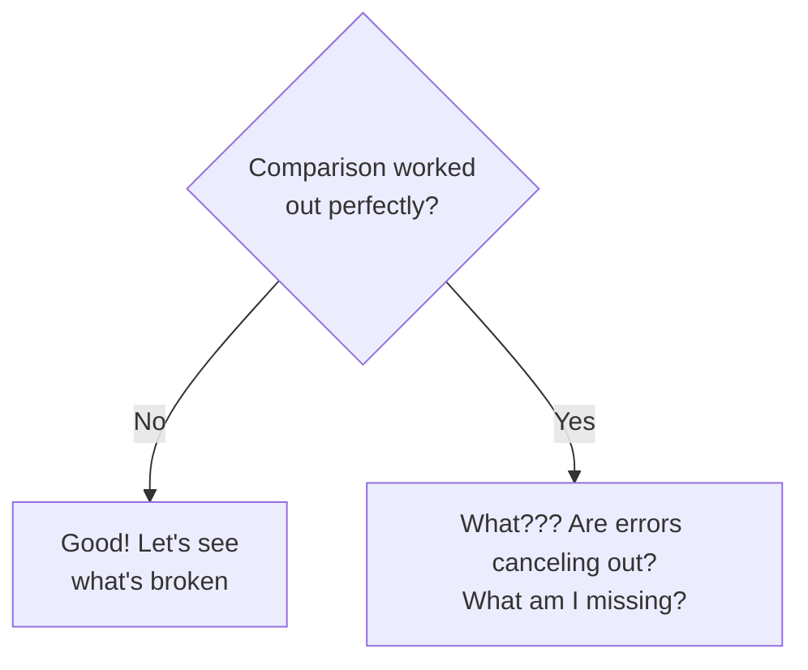

They are easy to make, but difficult to interpret. For behind every comparison, there has to lie an inherent confidence in one side of the equation. This confidence could be based out of the accuracy, quality, or even a widely accepted opinion. It is this very confidence that provides us a platform to base our interpretation of the comparison of the other side of the equation.

But what if that confidence is misplaced? What if the model we believe in is flawed? What if the measurement we are comparing it to is inaccurate? In that case, the comparison, unknowingly, becomes trifling, meaningless at the best and dangerous at the worst.

Since I began working in the solar industry, I have performed several model-to-model and model-to-measurement comparisons. And usually, each of these have been journeys from excitment to frustration. A model-to-model comparison needs me to believe more in one model over the other. And our belief in the 'better' model should rise from a good model-to-measured comparison. A good model-to-measured comparison arises from high quality measurements taken over a 'long' enough period, capturing enough diversity in the conditions which model is expected to be used. But then, what defines as long enough? What defines as high quality? And, what is enough diversity?

I think I have reached a point where the outcome of any comparison is either frustration in case things don't line well, and a ton of skepticism if things do align well! But, fortunately, I am surrounded by really wise people - Mark, showed me that there is something beyond these shocks and surprises and exuberance, and that is our constant pursuit of understanding the comparison itself. The way I see it is like aiming towards a really distant star, may be a billion light years away - one which is there mainly to serve as a direction, but the goal is exploring and becoming wiser of the space you cover in moving towards it. In short, 

Instead of shock or surprise, we should expect challenges. Instead of exuberance, we should be skeptical when comparisons workout perfectly. Errors often cancel out and give out a false picture, behind which the danger lies.
